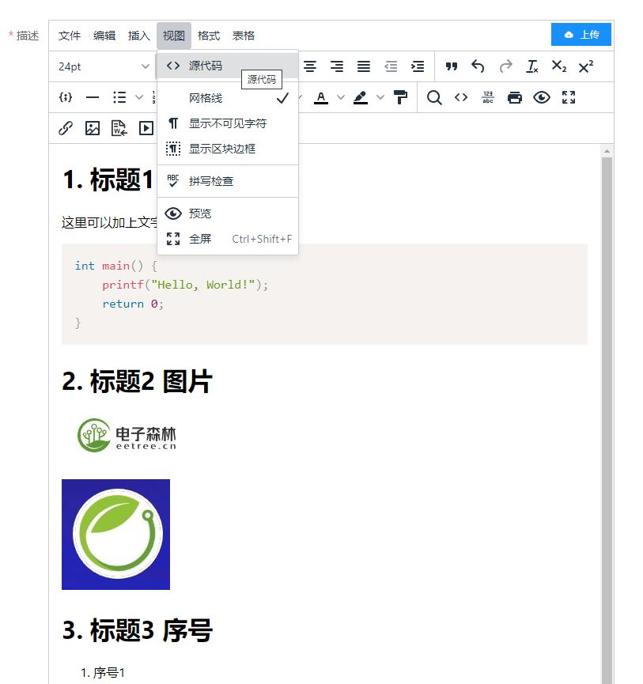

# 将 Markdown 转换为 HTML

本脚本可将 Markdown 文件转换为 HTML 文件，并对 HTML 文件进行以下处理：

- 为代码块添加 `language-c` 类。
- 将 HTML 中的图片编码为 base64，粘贴到源码的过程中即完成了上传，支持多张图片同时上传。
- 对 HTML 中的图片大小进行控制。
- 对 HTML 中的标题添加样式。

## 安装依赖项

使用以下命令安装依赖项：

```
pip install markdown lxml Pillow
```

## 使用方法

使用以下命令将 Markdown 文件转换为 HTML 文件：

```
python main.py example.md example.html
```

其中，`main.py` 是脚本文件名，`example.md` 是输入的 Markdown 文件名，`example.html` 是输出的 HTML 文件名。

## 说明

- 输入文件必须是 Markdown 格式，输出文件将以 HTML 格式保存。
- 转换过程中，会将 Markdown 文件中的代码块添加 `language-c` 类，因此 HTML 文件中的代码块将具有合适的样式。
- 如果 Markdown 文件中包含图片，则会将图片编码为 base64 格式，并将 HTML 文件中的 `img` 标签的 `src` 属性替换为 base64 编码后的图片。
- 自动缩图，过程中会检查图片的储存，自动将宽度在720以上的图片缩小为720。防止图片过大造成上传失败。
- HTML 文件中的标题将添加样式。
- 支持格式包括jpg,jpge,png,svg，其他格式尚未测试。

## 示例

- 输入的 Markdown 文件 `example.md` 内容如下：

  ````
  # 1. 标题1 代码
  
  这里可以加上文字
  
  ```c
  int main() {
      printf("Hello, World!");
      return 0;
  }
  ```
  
  # 2. 标题2 图片
  
  
  
  
  
  # 3. 标题3 序号
  
  1. 序号1
     
      测试1
  
  2. 序号2
      
      测试2
  
  3. 序号3
      
      测试3
  ````

- 运行以下命令：

  ```
  python main.py example.md example.html
  ```

- 输出的 HTML 文件 `example.html` 内容如下：

  ```
  <html><body><h1><span style="font-size: 24pt;"><strong>1. 标题1 代码</strong></span></h1>
  <p>这里可以加上文字</p>
  <pre class="language-c"><code class="language-c">int main() {
      printf("Hello, World!");
      return 0;
  }
  </code></pre>
  <h1><span style="font-size: 24pt;"><strong>2. 标题2 图片</strong></span></h1>
  <p></p>
  <p></p>
  <h1><span style="font-size: 24pt;"><strong>3. 标题3 序号</strong></span></h1>
  <ol>
  <li>
  <p>序号1</p>
  <p>测试1</p>
  </li>
  <li>
  <p>序号2</p>
  <p>测试2</p>
  </li>
  <li>
  <p>序号3</p>
  <p>测试3</p>
  </li>
  </ol></body></html>
  ```

* 将`example.html`中的代码直接复制到硬禾学堂的编辑器的源码中即可直接生成网页，图片同时也完成上传。

​		